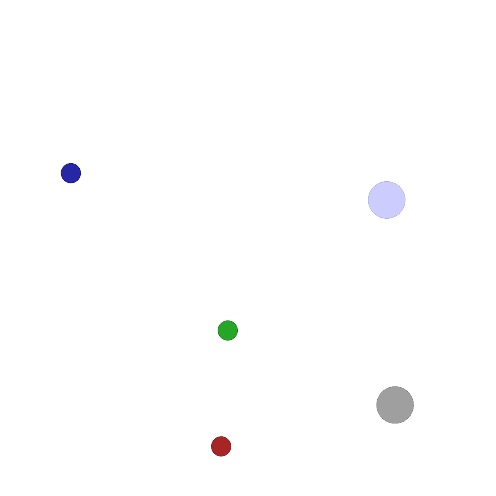
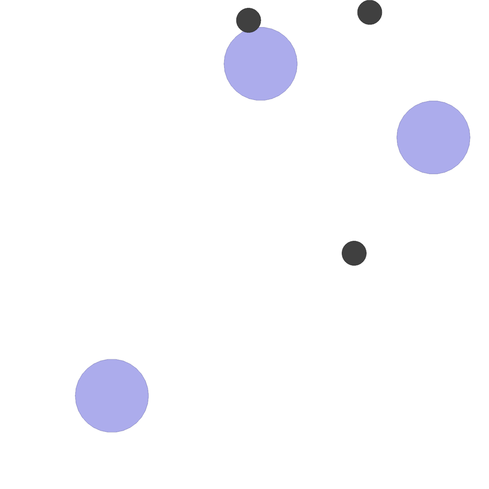
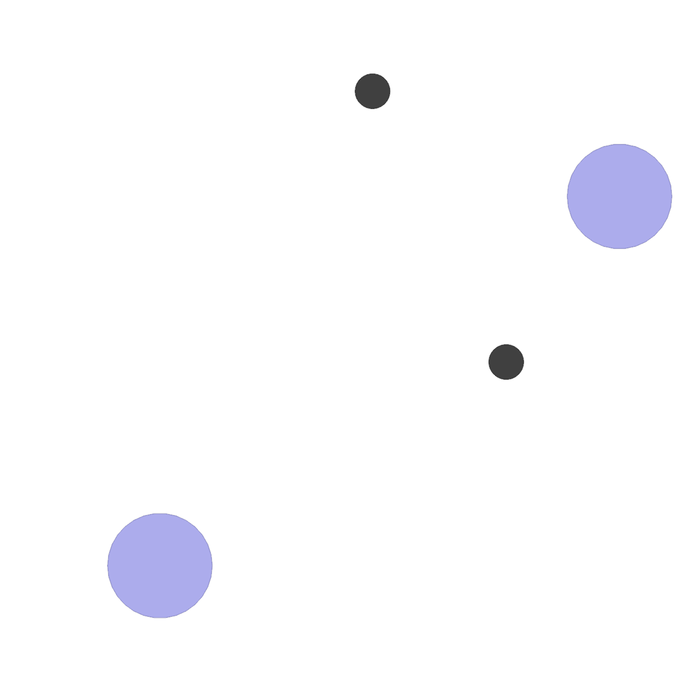
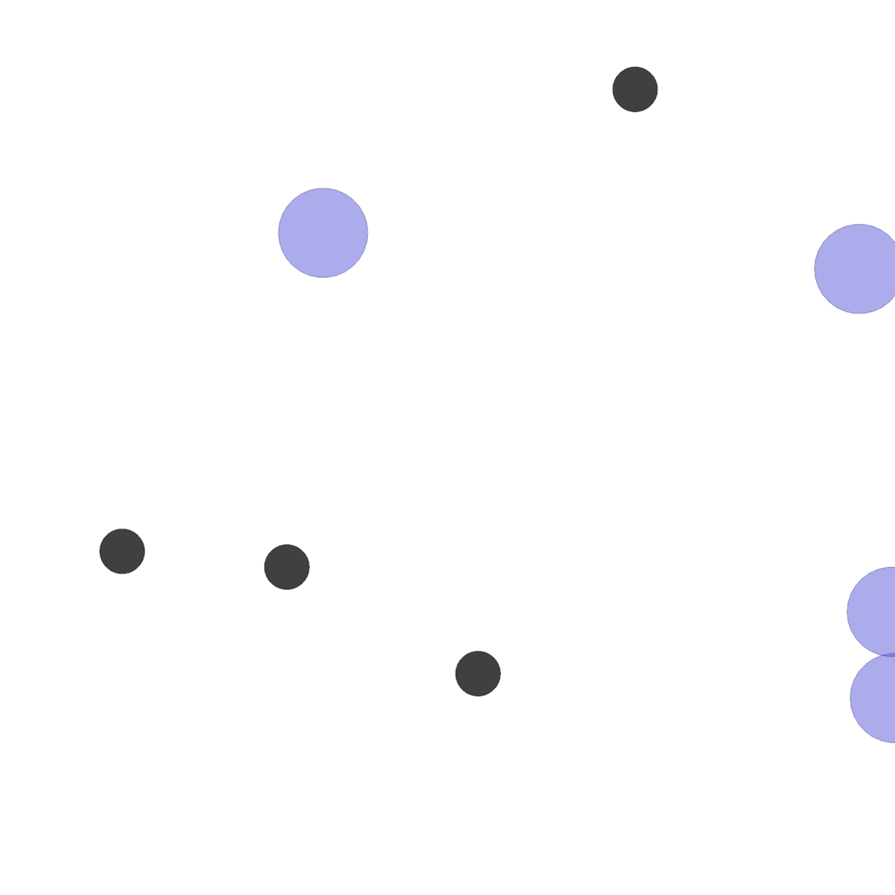

# Value-Aware Prediction for Robust Multi-Agent Coordination Under Communication Loss

Official codebase for our paper accepted at the **2026 IEEE/RSJ International Conference on Intelligent Robots and Systems (IROS 2026)**.

**Authors:** Kemal Devrim Kafadar*, Eren Özaltun*, Mahmud Efnan Şanlı, Feyza Orak, Emirhan Gazi, Kubilay Kağan Kömürcü, Nazım Kemal Üre (*Equal Contribution)

---

## Overview

This repository implements **Value-Aware MARO**, an advantage-weighted observation imputation framework for Multi-Agent Reinforcement Learning (MARL) operating under intermittent communication loss. 

Our codebase extends the MARO baseline by Santos et al. within the [hybrid-marl](https://github.com/PPSantos/hybrid-marl) and [EPyMARL](https://github.com/uoe-agents/epymarl) libraries, supporting MAPPO and IPPO across Multi-Agent Particle Environment (MPE) benchmarks.

---

## Visualizations

Episode rollouts (communication probability 1.0) for selected MPE environments:

| Environment | Demo |
|-------------|------|
| SimpleBlindDeaf (HearSee) |  |
| SimpleSpeakerListener |  |
| SimpleSpreadBlind (SpreadBlindfold) |  |
| SimpleSpreadXY (SpreadXY-2) |  |
| SimpleSpreadXY4 (SpreadXY-4) |  |

## Dependencies

- Python 3.8.x (original experiments were run with 3.8.10)
- MPE (`multiagent-particle-envs`)

Note: This repo includes a copy of MPE under `multiagent-particle-envs/`.

## Installation

```bash
./install.sh
```

## Running experiments

Use `run.sh` (or the manual command below). Key variables:

### Environments (MPE)

| `ENV` value | Environment |
|---|---|
| `SimpleSpreadXY-v0` | SpreadXY-2 |
| `SimpleSpreadXY4-v0` | SpreadXY-4 |
| `SimpleSpreadBlind-v0` | SpreadBlindfold |
| `SimpleBlindDeaf-v0` | HearSee |
| `SimpleSpeakerListener-v0` | SimpleSpeakerListener |

### Algorithms

| `ALGO` value | Description |
|---|---|
| `ippo` | IPPO |
| `ippo_ns` | IPPO (NS variant) |
| `mappo` | MAPPO |
| `mappo_ns` | MAPPO (NS variant) |

### Perception (MARO): selecting the method

Our comparison is controlled by the **perception config name**, selected via `PERCEPTION` (in `run.sh`), which copies the chosen file from `src/config/custom_configs/` into `src/config/perception.yaml`:

- **Value-Aware MARO**: `va_maro` (`value_aware: True`)
- **MARO baseline**: `maro` (`value_aware: False`)

The two configs differ only in `value_aware` (and, for the value-aware variant, `adv_lambda`); they share the same predictor architecture. Set `PERCEPTION` in `run.sh`, or copy the config manually as shown below.

### Time limit

- `TIME_LIMIT=25` for the MPE environments above.

### Example (single run)

```bash
ENV="SimpleSpreadBlind-v0"
ALGO="mappo_ns"
PERCEPTION="va_maro"   # "va_maro" = Value-Aware MARO, "maro" = MARO baseline
TIME_LIMIT=25

cp "src/config/custom_configs/${PERCEPTION}.yaml" src/config/perception.yaml

python3 src/main.py --config="$ALGO" --env-config=gymma \
    with env_args.key="$ENV" env_args.time_limit=$TIME_LIMIT seed=0
```

Outputs are written under `results/` (Sacred runs under `results/sacred/` and CSV logs under `results/logs/`).

## References

- [EPyMARL](https://github.com/uoe-agents/epymarl) — Extended PyMARL framework
- [hybrid-marl](https://github.com/PPSantos/hybrid-marl) — Base algorithm implementations
- [OpenAI MPE](https://github.com/openai/multiagent-particle-envs) — Multi-agent particle environments
- [LBF](https://github.com/semitable/lb-foraging) — Level-based foraging environment


---

## License and Acknowledgements

This codebase is licensed under the [Apache License 2.0](LICENSE).

This project is built upon and extends the [hybrid-marl](https://github.com/PPSantos/hybrid-marl) repository by P. P. Santos et al., which itself extends the [EPyMARL](https://github.com/uoe-agents/epymarl) library by Papoudakis et al. Both foundational frameworks are open-sourced under the Apache License 2.0.
